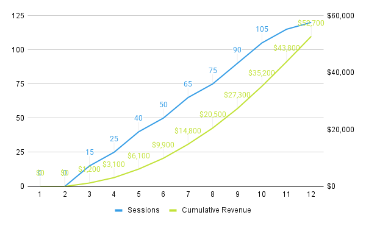
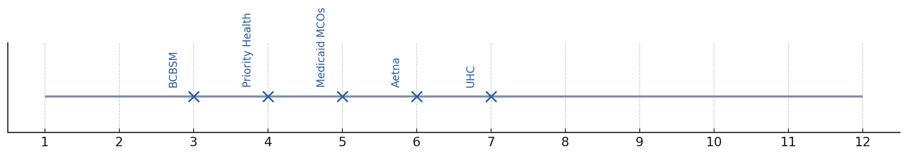

# Sample: Market Report & Launch Plan

_A strategic credentialing and revenue roadmap for_ Davis OT, _a pediatric occupational therapy practice in metro Detroit._

_Prepared by pie Health_

### Executive Overview 

<table data-header-hidden><thead><tr><th width="255">Item</th><th></th></tr></thead><tbody><tr><td><strong>Provider</strong></td><td>Darla Davis</td></tr><tr><td><strong>Practice Name</strong></td><td>Davis OT</td></tr><tr><td><strong>Practice Type</strong></td><td>Pediatric Occupational Therapy (Solo Practice)</td></tr><tr><td><strong>Region</strong></td><td>Metro Detroit, MI</td></tr><tr><td><strong>Business Status</strong></td><td>EIN, NPI-1, NPI-2, CAQH, Articles of Organization complete</td></tr><tr><td><strong>Credentialing Focus</strong></td><td>BCBSM/BCN, Medicaid MCOs, Priority Health, Aetna, UnitedHealthcare</td></tr><tr><td><strong>Total pie Health Investment</strong></td><td>$2,650</td></tr><tr><td><strong>Monthly Revenue at Capacity</strong></td><td>$8,900</td></tr><tr><td><strong>Break-Even Month</strong></td><td>Month 5</td></tr></tbody></table>

### 1. Introduction & Strategic Rationale 

Davis OT is a new pediatric occupational therapy practice launching in Metro Detroit. The provider, Darla Davis, OTR/L, brings both clinical expertise and community insight to this underserved yet high-potential market. This report outlines a payer-informed, credentialing-backed growth plan designed to reach $97,000 in annual revenue within 12 months.

We call it a launch plan because it reflects acceleration — from zero to full panel — powered by strategy, data, and support from pie Health.

### 2. Market Opportunity in Metro Detroit 

#### Key Regional Facts 

* **Population:** 4.3+ million residents
* **Pediatric Need:** High Medicaid eligibility in Detroit proper; mixed commercial coverage in suburbs
* **Top Employers:** Ford, GM, Henry Ford Health, Trinity Health, Detroit Public Schools
* **Payer Environment:** Dominated by BCBSM/BCN, with significant roles played by Medicaid MCOs, Priority Health, Aetna, and UHC

| Employer                        | Sector     | Likely Insurers   |
| ------------------------------- | ---------- | ----------------- |
| Ford, GM, Stellantis            | Automotive | BCBSM, Aetna, UHC |
| Henry Ford Health, Trinity, DMC | Healthcare | BCBSM, Priority   |
| University of Michigan, DPS     | Education  | BCBSM, Priority   |
| City of Detroit                 | Government | BCBSM, BCN, HAP   |

### 3. Methodology & Payer Mix Rationale 

The projected payer mix was built using local data, payor market share reports, and firsthand insights from the provider and regional trends:

<table><thead><tr><th width="195">Payer</th><th width="90">Allocation</th><th>Rationale</th></tr></thead><tbody><tr><td><strong>BCBSM/BCN</strong></td><td>30%</td><td>Michigan's largest commercial insurer; “super popular” locally</td></tr><tr><td><strong>Medicaid MCOs</strong></td><td>30%</td><td>Essential for low-income families; key for pediatric referrals</td></tr><tr><td><strong>Priority Health</strong></td><td>20%</td><td>Strong regional share in Southeast MI</td></tr><tr><td><strong>Aetna</strong></td><td>15%</td><td>Commercial and Medicaid MCO presence</td></tr><tr><td><strong>UnitedHealthcare</strong></td><td>5%</td><td>Smaller but steady role in OT reimbursement</td></tr></tbody></table>


Pediatric OTs typically see higher Medicaid representation due to family income thresholds and early intervention funding sources.


### 4. Billing & Reimbursement Assumptions 

Revenue modeling uses **CPT** **97530 (Therapeutic Activities – 15 minutes)** as the primary billing code across all payer types. Reimbursement rates were benchmarked by payor and adjusted for regionally conservative assumptions:

| CPT Code | Description            | Rate Used                  |
| -------- | ---------------------- | -------------------------- |
| 97530    | Therapeutic Activities | $57–$80 depending on payer |

### 5. Revenue Forecast: Full Capacity 

| Payer            | % Caseload | Sessions/Month | Rate | Monthly Revenue | Annual      |
| ---------------- | ---------- | -------------- | ---- | --------------- | ----------- |
| BCBSM/BCN        | 30%        | 36             | $80  | $2,880          | $34,560     |
| Priority Health  | 20%        | 24             | $70  | $1,680          | $20,160     |
| Aetna            | 15%        | 18             | $65  | $1,170          | $14,040     |
| Medicaid MCOs    | 30%        | 36             | $57  | $2,052          | $24,624     |
| UnitedHealthcare | 5%         | 6              | $60  | $360            | $4,320      |
| **Total**        | **100%**   | **120**        | —    | **$8,142**      | **$97,704** |

### 6. Credentialing Plan with pie Health 

| Service                       | Price      |                                                   |
| ----------------------------- | ---------- | ------------------------------------------------- |
| Discovery & Eligibility Check | $375       | Confirm payor participation & requirements        |
| Provider Setup                | $50        | Gather documents, CAQH, NPI                       |
| Group Enrollment (if needed)  | $150       | Setup for billing via NPI-2                       |
| Payor Applications (5×)       | $875       | Each includes follow-up to effective date         |
| **One-Time Total**            | **$1,450** |                                                   |
| Ongoing Maintenance           | $100/mo    | Support, directory maintenance, revalidation      |
| **Annual Total**              | **$2,650** | Includes credentialing + 12 months of maintenance |

### 7. Revenue Ramp-Up & Patient Growth Timeline 

<figure><figcaption></figcaption></figure>


This chart illustrates Davis OT’s projected monthly revenue and patient sessions over the first year.


<figure><figcaption></figcaption></figure>


This visual marks the expected month each major payer becomes effective, beginning with BCBSM in Month 3. It reflects the staggered credentialing process and provides a simple reference for when reimbursements are anticipated to begin from each insurer.


### 8. Timeline Narrative 

| Phase                  | Months | Activity                   | Result             |
| ---------------------- | ------ | -------------------------- | ------------------ |
| Phase 1: Credentialing | 1–2    | All applications submitted | $0 revenue         |
| → First Approval       | 3      | BCBSM starts               | $1,200             |
| → Add Priority         | 4      | Start building referrals   | $1,900             |
| → Medicaid Live        | 5      | School referrals begin     | $3,000             |
| → Add Aetna            | 6      | Word-of-mouth grows        | $3,800             |
| Phase 2: Growth        | 7–8    | Network established        | $4,900–$5,700      |
| Phase 3: Maturity      | 9–12   | Near/full capacity         | Up to $8,900/month |

### 9. Pediatric OT-Specific Market Insights 

* **Family referrals drive growth** — parent word-of-mouth is essential
* **Schools and early intervention programs** generate high-volume referrals
* **Fall (Sept–Nov)** is peak referral season due to school IEPs
* **Summer can be mixed** — some drop off, others intensify treatment
* **Home visits** are a strategic differentiator against clinic-based competition

***

### 10. Risks & Mitigation Strategies 

| Risk                              | Impact            | Mitigation                                       |
| --------------------------------- | ----------------- | ------------------------------------------------ |
| Credentialing delays              | Cash flow issues  | Private-pay sessions in early months             |
| Slower-than-expected referrals    | Growth delay      | Invest in early intervention contacts            |
| Competition from hospital systems | Referral scarcity | Differentiate via home visits and responsiveness |
| Seasonal drop-offs                | Lost revenue      | Frontload evaluation outreach in fall            |

### 11. Summary Recommendations 

* Begin credentialing immediately with BCBSM and Medicaid MCOs
* Consider early marketing to schools, EI programs, and parent groups
* Track payor approval dates and patient volume closely
* Use home-visit option to build niche loyalty
* Meet monthly with pie Health to review payer progress

***

### Appendix: Sources & References 

**Regional & Market Research**

\[3] _Economy of Metropolitan Detroit_ — [https://en.wikipedia.org/wiki/Economy\_of\_metropolitan\_Detroit](https://en.wikipedia.org/wiki/Economy_of_metropolitan_Detroit)\
\[4] _City of Detroit Benefit Booklet_ — [https://detroitmi.gov/](https://detroitmi.gov/)...\
\[5] _Top 25 Health Insurance Companies – PeopleKeep_ — [https://www.peoplekeep.com/blog/top-25-health-insurance-companies-in-the-u.s](https://www.peoplekeep.com/blog/top-25-health-insurance-companies-in-the-u.s)\
\[6] _Employee Benefits Summary (MI) – MployerAdvisor_ — [https://mployeradvisor.com/state-benefit-guides/](https://mployeradvisor.com/state-benefit-guides/)...\
\[7] _Detroit Chamber Workforce Data_ — [https://www.detroitchamber.com/](https://www.detroitchamber.com/)...\
\[8] _Major Employers in Michigan – The Michigan Life_ — [https://themichiganlife.org/](https://themichiganlife.org/)...\
\[9] _Detroit Regional Partnership Employer List_ — [https://www.detroitregionalpartnership.com/](https://www.detroitregionalpartnership.com/)...\
\[10] _Perplexity Research Summary_ — Used to build revenue ramp-up and payer mix\
\[11] _Crain’s Detroit Business Data_ — [https://www.crainsdetroit.com](https://www.crainsdetroit.com/)\
\[12] _Blossom Children’s Center – OT Billing Guidance_ — [https://blossomchildrenscenter.com/occupational-therapy/](https://blossomchildrenscenter.com/occupational-therapy/)

\
 
